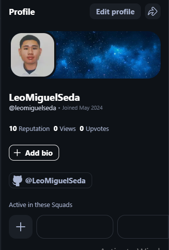

<a name="readme-top">

<br/>

<br />
<div align="center">
  <a href="https://github.com/LeoMiguelSeda">
  
  </a>

  <h3 align="center">Personal Website</h3>
</div>

<div align="center">
  This is my Personal Website that I created for all the lessons I learned from the class.
</div>

<br />


---

<br />
<br />


<details>
  <summary>Table of Contents</summary>
  <ol>
    <li>
      <a href="#overview">Overview</a>
      <ol>
        <li>
          <a href="#key-components">Key Components</a>
        </li>
        <li>
          <a href="#technology">Technology</a>
        </li>
      </ol>
    </li>
    <li>
      <a href="#rule,-practices-and-principles">Rules, Practices and Principles</a>
    </li>
    <li>
      <a href="#resources">Resources</a>
    </li>
    <li>
      <a href="#deployment-link">Deployment link</a>
    </li>
  </ol>
</details>

---

## Overview


This repository documents our learning and practical application of concepts covered during the term for Web Design. Here, we detail how we applied theoretical knowledge in hands-on technical projects. This README serves as a guide to understand the scope of our work, showcasing the practical outcomes and demonstrating our understanding of the course material in real-world scenarios.

Guiding Question:
- This project if for making a Personal Website
- This shows on how we apply the lessons we learned at during our journey to this course
- It is a MultiPage Website where you can click navigations and buttons to riderect to the pages or repository in github
- The Technology I used are HTML and CSS I applied it for all pages because it's more easy to make it.

### Key Components

- MultiPage Website


### Technology


## Rules, Practices and Principles
1. Always use `WD-` in the front of the Title of the Project for the Subject followed by your custom naming.
2. Do not rename any .html files; always use `index.html` as the filename.
3. Place Files in their respective folders.
4. All file naming are in camel case.
   - Camel case is naming format where there is no white space in separation of each words, the first word is in all lower case while the succeding words first letter are in upper followed by lower cased letters.
   - ex.: buttonAnimatedStyle.css
5. Use only `External CSS`.
6. Renaming of Pages folder names are a must, and relates to what it is doing or data it holding.
7. File Structure to follow below.

```
WD-ProjectName
└─ assets
|   └─ css
|   |   └─ style.css
|   └─ img
|   |   └─ fileWith.jpeg/.jpg/.webp/.png
|   └─ js
|       └─ script.js
└─ pages
|  └─ pageName
|     └─ assets
|     |  └─ css
|     |  |  └─ style.css
|     |  └─ img
|     |  |  └─ fileWith.jpeg/.jpg/.webp/.png
|     |  └─ js
|     |     └─ script.js
|     └─ index.html
└─ index.html
└─ readme.md
```

## Resources


| Title | Purpose | Link |
|-|-|-|
| Build a Complete Responsive Personal Portfolio Website using HTML CSS Javascript | This is the reference I used to make this final project but instead I didn't use a javascript | https://www.youtube.com/watch?v=Tkp3FDgOueM&ab_channel=Codehal |

## Deployment Link:
https://leomiguelseda.github.io/WD-Finals/
